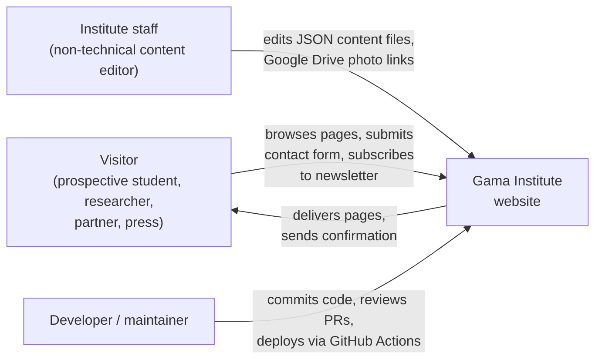
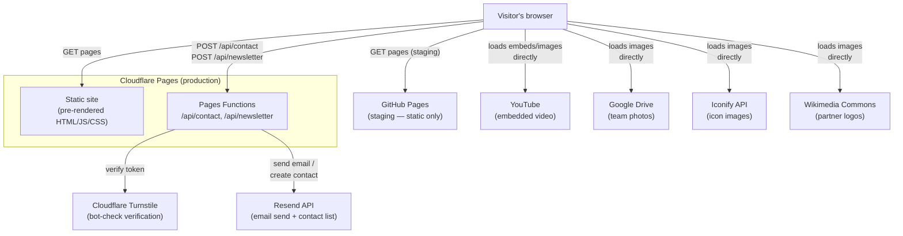

# 3. System Scope and Context

## Business context

Who and what the system serves, and what crosses its boundary:

Staff and developers don't interact with a running admin panel — "editing the system" means editing files in the repository (JSON content, or component code) and pushing through the normal git/CI flow. There is no separate content-management system or admin UI.

## Technical context

What the deployed system talks to over the network:

Everything below the browser in the second half of the diagram (YouTube, Google Drive, Iconify, Wikimedia Commons) is loaded **directly by the visitor's browser**, not proxied through Cloudflare Pages Functions — the site itself never talks to these services server-side, it just references their URLs in content. This is why `public/_headers`' Content Security Policy explicitly allowlists each of these hosts under `img-src`/`frame-src`; anything not on that list simply fails to load.

This diagram deliberately starts at "the visitor's browser already has a connection to Cloudflare Pages" — it doesn't show *how* the browser got there (domain registration, DNS resolution, TLS). That's infrastructure, not application architecture, and belongs in [7 — Deployment View](07-deployment-view.md#network-infrastructure--domain-dns-and-tls), which covers Namecheap (registrar), Cloudflare's DNS/TLS layer, and the DNS records that make outbound email deliverable.

## External systems

| System | Used for | Where it's configured |
|---|---|---|
| **Cloudflare Turnstile** | Invisible bot-check before the contact form and newsletter signup submit — see [D-2](../../DECISIONS.md#d-2-invisible-cloudflare-turnstile--no-visible-widget) | `VITE_TURNSTILE_SITE_KEY` (build-time), `TURNSTILE_SECRET_KEY` (Cloudflare Pages env var) |
| **Resend** | Sends the contact form's email, and registers newsletter signups as Resend Contacts — no separate CRM, see [D-3](../../DECISIONS.md#d-3-contact-form-and-newsletter-both-use-resend--no-separate-crm) | `RESEND_API_KEY`, `CONTACT_EMAIL_TO`, `CONTACT_EMAIL_FROM` (Cloudflare Pages env vars) |
| **YouTube** | Hosts every video shown on the site (WeekPaper episodes, the vision video) — the site only embeds YouTube's player, it doesn't host video itself | Video URLs are plain content, set per-page in i18n JSON |
| **Google Drive** | The documented way for non-technical staff to host and swap team member photos without a code change — see [D-10](../../DECISIONS.md#d-10-team-member-photos-are-linked-via-url-google-drive-not-committed-to-the-repo) | Photo URLs are plain content in `team.json` |
| **Iconify** (`api.iconify.design`) | Serves category/pillar icons as remote SVG images on About and WeekPaper, rather than bundling an icon library | Icon URLs are plain content in `about.json`/`weekpaper.json` |
| **Wikimedia Commons / partner sites** | Source of the partner-university logos shown on Home (currently hidden pending confirmed partnerships — see [11](11-risks-and-technical-debt.md)) | Logo URLs are plain content, see [D-11](../../DECISIONS.md#d-11-academic-partner-logos-on-the-homepage-are-hotlinked-from-wikimedia-commons-and-partner-sites) |
| **GitHub / GitHub Actions** | Source control, CI build, and the deploy pipeline to both hosting targets | `.github/workflows/` |
| **Cloudflare Pages** | Production hosting — static assets + serverless Functions | `wrangler.toml`, Cloudflare Pages dashboard |
| **GitHub Pages** | Staging hosting — static assets only, no Functions | `.github/workflows/deploy-staging.yml` |
| **Namecheap** | Domain registrar for `gamainstitute.ca` — registration only, does not serve DNS or traffic | Namecheap dashboard; nameservers delegated to Cloudflare, see [7 — Deployment View](07-deployment-view.md#network-infrastructure--domain-dns-and-tls) |
| **Cloudflare (DNS + TLS)** | Hosts the DNS zone for `gamainstitute.ca` (the site's records, plus SPF/DKIM/DMARC for Resend email deliverability) and issues/renews the TLS certificate — a distinct role from Cloudflare Pages hosting, delegated to the same provider | Cloudflare dashboard, DNS tab — not in this repo |

**Not present**, despite appearing in the original SRS: Sentry (error tracking), Cloudflare Web Analytics, a dedicated uptime monitor. See [11 — Risks and Technical Debt](11-risks-and-technical-debt.md).
