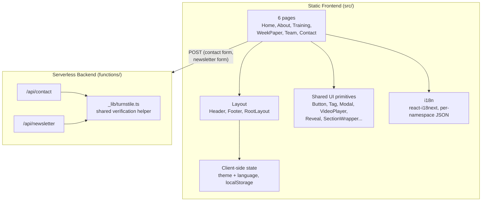

# 5. Building Block View

## Level 1 — whitebox of the overall system

The frontend and backend are two independent build targets that happen to deploy together on Cloudflare Pages: the frontend is a fully static build (works with no backend at all, as proven by the GitHub Pages staging environment), and the backend is two small, stateless serverless functions with no dependency on the frontend's internals beyond a shared Zod schema (`src/types/contact.ts`) that both sides import.

## Level 2 — Frontend decomposition

| Building block | Location | Responsibility |
|---|---|---|
| Routing | `src/routes.tsx` | Maps each URL path to a page component, code-split via React Router's `lazy()` loader so each page ships its own JS chunk |
| `RootLayout` | `src/routes.tsx` | The one part of the frontend that's never code-split — wraps every page in `Header`/`Footer`, provides i18n and Helmet context |
| Pages | `src/pages/*.tsx` | One file per page; see [docs/pages/](../pages/README.md) for a full section-by-section breakdown of each |
| Layout components | `src/components/layout/` | `Header` (nav, language/theme toggles), `Footer` (link grid, social icons) |
| Shared UI primitives | `src/components/ui/` | Reusable building blocks used across pages — `Button`, `Tag`, `Modal`, `VideoPlayer`, `Reveal`/`SectionWrapper`/`PageHero`, `NewsletterForm` — documented once in [docs/pages/README.md](../pages/README.md#shared-building-blocks) |
| Page-specific components | `src/components/{training,team,weekpaper,forms}/` | Components used by only one page — `CourseCard`, `MemberCard`, `EpisodeCard`, `ContactForm` |
| Brand assets | `src/components/brand/` | `NetworkArt` (animated SVG graphic) and `BrandMark` (logo image) |
| i18n | `src/i18n/` | `react-i18next` setup; one JSON namespace per page plus a shared `common` namespace, in `src/i18n/locales/{fr,en}/` |
| Content data (non-text) | `src/data/` | `courses.ts` (course structure/styling, paired with translated text in `training.json`), `network.ts` (the brand graphic's node/edge coordinates) |
| Client-side state | `src/hooks/useTheme.ts`, `localStorage` | Theme and language preference — no state-management library, just two `localStorage` keys and an anti-FOUC inline script in `index.html` |
| Design tokens / constants | `src/constants/index.ts` | Animation timing (`ANIM`), brand gradient stops, social links, contact email, `localStorage` key names |

## Level 2 — Backend decomposition

| Building block | Location | Responsibility |
|---|---|---|
| Contact form endpoint | `functions/api/contact.ts` | Validates the submitted form (Zod), verifies the Turnstile token, sends the message via Resend to `CONTACT_EMAIL_TO` |
| Newsletter endpoint | `functions/api/newsletter.ts` | Validates the email (Zod), verifies the Turnstile token, registers the address as a Resend Contact |
| Shared Turnstile verification | `functions/_lib/turnstile.ts` | Single implementation of the Cloudflare siteverify call, used by both endpoints above — added 2026-09-09 to remove duplication and ensure both endpoints are protected identically |
| Shared Zod schema | `src/types/contact.ts` | `ContactSubject` enum and `contactSchema`, imported by both the client form (`ContactForm.tsx`) and the server function (`contact.ts`) — the one place client and server share a type definition |

## Why there's no "Level 3"

arc42 allows further whitebox decomposition of individual building blocks. At this project's size, a third level would mostly restate what's already covered file-by-file in [docs/pages/](../pages/README.md) (which documents every component's props and behavior down to the individual gotcha) — so this document stops at Level 2 and defers to that folder for anything more granular.
