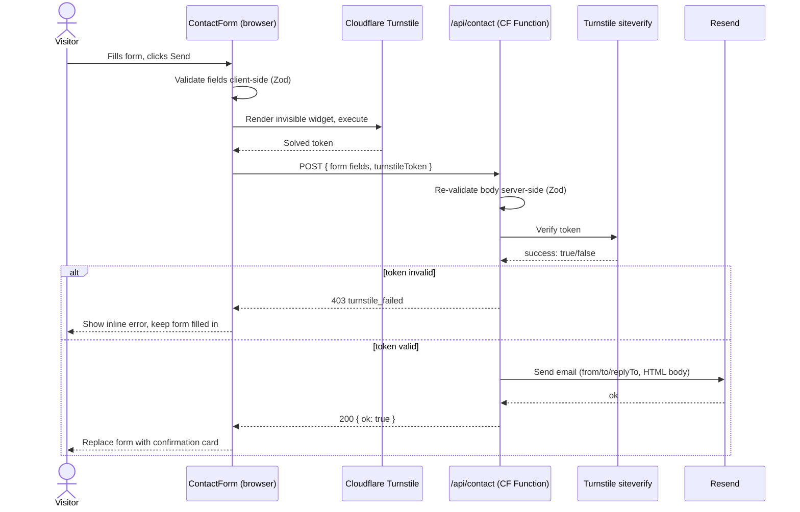
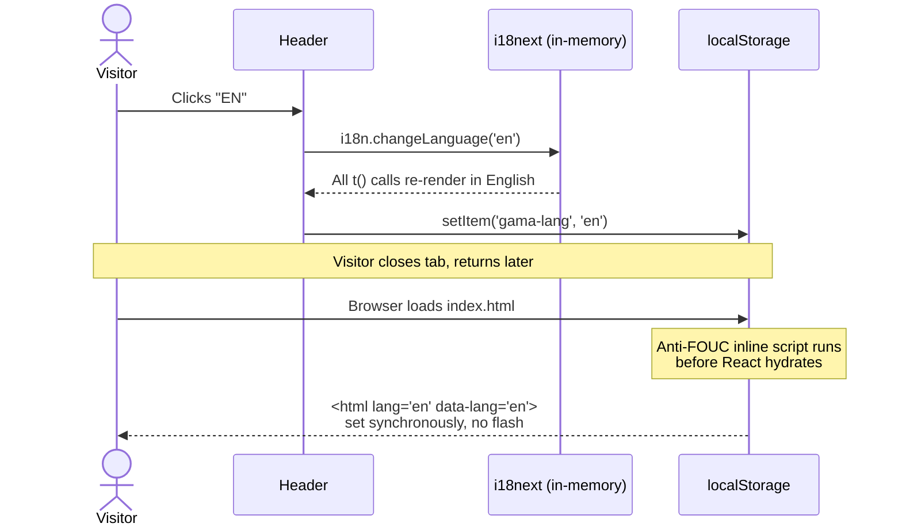
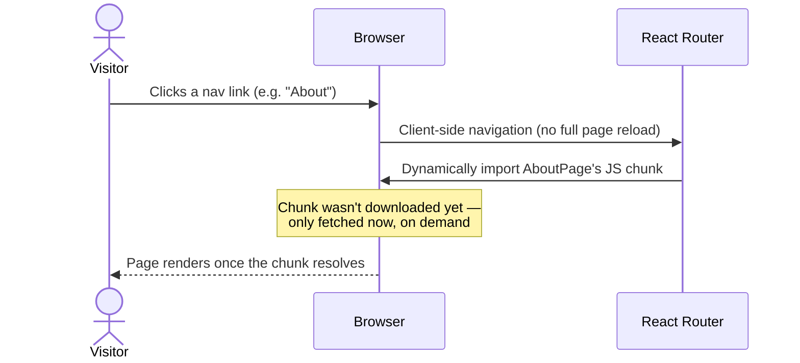

# 6. Runtime View

Key scenarios, chosen because each illustrates a different architectural mechanism worth understanding rather than being an exhaustive list of every user action.

## Scenario 1: Visitor submits the contact form

Client-side validation happens first purely for fast feedback — the server-side Zod check in the Function is what's actually trusted; a request that skipped the browser entirely (e.g. a script hitting the endpoint directly) still gets fully re-validated. See [8 — Cross-cutting Concepts](08-crosscutting-concepts.md) for why this matters.

## Scenario 2: Visitor subscribes to the newsletter

Structurally identical to Scenario 1 — same Turnstile-then-Resend pattern, same shared `functions/_lib/turnstile.ts` helper — except it calls `resend.contacts.create({ email })` instead of sending an email, and there's no visible error message on failure (see [docs/pages/README.md](../pages/README.md#newsletter) for that specific gap). This endpoint gained Turnstile protection on 2026-09-09; before that it had no bot protection at all — see [11 — Risks and Technical Debt](11-risks-and-technical-debt.md) for the history.

## Scenario 3: Visitor switches language

No network request is involved anywhere in this scenario — every page's text for both languages is already in the downloaded JavaScript bundle (see the "all namespaces load eagerly" gotcha in [docs/pages/README.md](../pages/README.md)). The only reason a page reload doesn't flash the wrong language back is the inline script described in [D-4](../../DECISIONS.md#d-4-anti-fouc-inline-script-in-indexhtml).

## Scenario 4: Visitor navigates to a page for the first time

Because every page is registered with React Router's `lazy()` loader (not `React.lazy()` — see [docs/pages/README.md](../pages/README.md#how-every-page-is-put-together) for why that distinction matters for the static build), a first-time visit to any page only ever downloads that page's own code, plus the shared eager bundle (layout, i18n data, shared UI primitives). A **direct** first visit to `/about` (typed URL, or a search result) skips this entirely — the pre-rendered static HTML for that page is served immediately, and the JS chunk is only needed for any further client-side interaction on the page.
