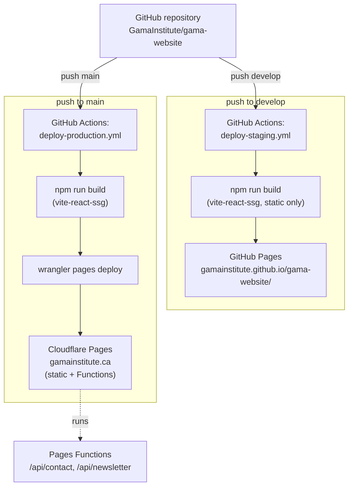
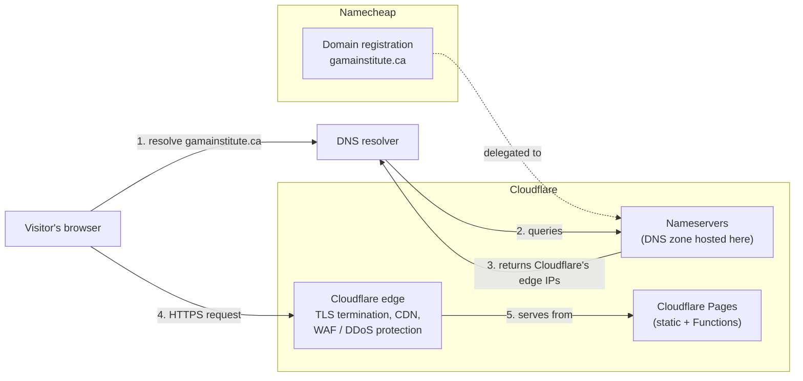

# 7. Deployment View

This section has two parts: how a **code change** reaches a running environment (the CI/CD pipeline), and how a **visitor's request** actually reaches that running environment over the network (domain, DNS, TLS). The first part was covered in the initial version of this document; the second — domain registration, DNS, and certificates — was missing and is filled in below.

## CI/CD pipeline

Two independent hosting environments are built from the same repository, triggered by pushes to two different branches. They are **not equivalent** — this is a deliberate constraint (see [2 — Architecture Constraints](02-architecture-constraints.md)), not an oversight.

## Staging — GitHub Pages

- **Trigger:** push to `develop`.
- **What it deploys:** the static build only — `npm run build` with `VITE_BASE_URL` set to the GitHub Pages project path (`/gama-website/`), so every asset URL and the client-side router's `basename` resolve correctly under that subpath.
- **What doesn't work here:** the contact form and newsletter signup. GitHub Pages serves static files only — there is no Cloudflare Pages Functions equivalent running, so both `POST` endpoints simply don't exist on this environment. This environment exists purely for reviewing UI/content changes on a stable, shareable URL before they reach production.
- **A real incident this caused:** the site's org/repo was renamed during a GitHub transfer, changing the actual served path, while `VITE_BASE_URL` in the workflow stayed hardcoded to the old value — every asset 404'd and visitors saw completely unstyled HTML until the workflow was updated to match. This is exactly the kind of thing that's invisible in code review unless someone actually loads the staging URL after a repo rename.

## Production — Cloudflare Pages

- **Trigger:** push to `main`.
- **What it deploys:** the static build *and* the two Pages Functions together, via `wrangler pages deploy dist --project-name=gamainstitute --branch=main`. This is the only environment where the full stack — including the contact form and newsletter backend — actually runs end-to-end.
- **Runtime env vars/secrets**, set in the Cloudflare Pages dashboard (not in the repo): `TURNSTILE_SECRET_KEY`, `CONTACT_EMAIL_TO`, `CONTACT_EMAIL_FROM`, `RESEND_API_KEY`. The authoritative, currently-accurate table of every environment variable (what it's for, where it's set) lives in [CLAUDE.md](../../CLAUDE.md#environment-and-secrets) — this document doesn't duplicate it to avoid the two drifting apart.
- **Build-time secret:** `VITE_TURNSTILE_SITE_KEY`, injected via a GitHub Actions secret at build time (it ends up baked into the static JS bundle — this is expected, since Turnstile's *site key* is meant to be public; only the *secret key* used server-side is sensitive).

## What's notably absent from this deployment picture

The original SRS described a third capability that was never actually built: **automatic per-pull-request preview deployments** on Cloudflare Pages (full stack, including Functions, for testing backend changes before merge). Only the two branch-triggered workflows above exist — there is no PR-triggered workflow in `.github/workflows/`. This means a pull request's backend changes currently cannot be exercised end-to-end until it's merged to `main`. See [11 — Risks and Technical Debt](11-risks-and-technical-debt.md).

## Network infrastructure — domain, DNS, and TLS

None of this lives in the repository — no DNS zone file, no certificate, no registrar config are checked in anywhere — which is *why* the first version of this document didn't cover it. It's real infrastructure the site depends on, administered directly in the Namecheap and Cloudflare dashboards, not through code or CI. Documented here so the full path from "someone types gamainstitute.ca" to "the CI/CD pipeline above" is actually complete.

- **Registrar:** the domain `gamainstitute.ca` is registered through **Namecheap**. Namecheap's own role ends at registration — it does not serve DNS or handle any traffic for the site.
- **DNS:** the domain's nameservers are delegated to **Cloudflare**, so Cloudflare hosts the actual DNS zone (the records that say "gamainstitute.ca points at Cloudflare Pages") and is the source of truth for every record on the domain, not just the ones related to hosting.
- **TLS/SSL certificate:** issued and auto-renewed by Cloudflare (Universal SSL) as part of the same edge network that serves the site — there is no separately-purchased or manually-managed certificate to renew. This is a direct consequence of delegating DNS to Cloudflare rather than pointing records at Cloudflare from an externally-hosted zone.
- **Edge protections:** the same Cloudflare edge that terminates TLS also provides the CDN caching, DDoS protection, and (per the SRS's security goals) the surface where Cloudflare-level controls like Rate Limiting rules would apply — see [11 — Risks and Technical Debt](11-risks-and-technical-debt.md) for the current unconfirmed status of that specific control.

### Email deliverability records (Resend)

The contact form sends outbound email, and the newsletter endpoint registers Resend contacts, both from a `CONTACT_EMAIL_FROM` address (see [CLAUDE.md](../../CLAUDE.md#environment-and-secrets)). **Worth confirming, not assumed here:** CLAUDE.md's own example value for this address is `Gama Institute <noreply@gama.institute>` — a *different* domain (`gama.institute`) from the site's own `gamainstitute.ca` (which is what `CONTACT_EMAIL_TO`, `contact@gamainstitute.ca`, uses). If the sending domain really is `gama.institute`, its SPF/DKIM/DMARC records live in whichever DNS zone hosts *that* domain, which may or may not be the same Namecheap/Cloudflare setup described above — that needs verifying against the actual production `CONTACT_EMAIL_FROM` value in the Cloudflare Pages dashboard, not inferred from the site's own domain.

Whichever domain it turns out to be: for a mailbox provider (Gmail, Outlook, etc.) to trust that mail and not send it to spam, the sending domain has to prove it authorized Resend to send on its behalf — that proof is **SPF**, **DKIM**, and **DMARC** records in that domain's DNS zone, set up per Resend's domain-verification instructions when `CONTACT_EMAIL_FROM` was configured. These records are load-bearing for the contact form actually reaching an inbox, not just for the site loading — a DNS record accidentally removed would silently degrade deliverability with no error appearing in the Pages Function itself (Resend would still report success; the message would just be more likely to land in spam or be rejected). This is a good candidate for the uptime/monitoring gap noted in [11 — Risks and Technical Debt](11-risks-and-technical-debt.md) — nothing currently alerts anyone if these records drift.

## Deploying a change

1. Push to `develop` → review on the GitHub Pages staging URL (UI/content only).
2. Merge/push to `main` → Cloudflare Pages production deploy, full stack.

There is no separate release/staging-promotion step beyond this — per [D-6](../../DECISIONS.md#d-6-production-deploy-on-main-branch), this is a deliberately minimal branching model for a small team.
